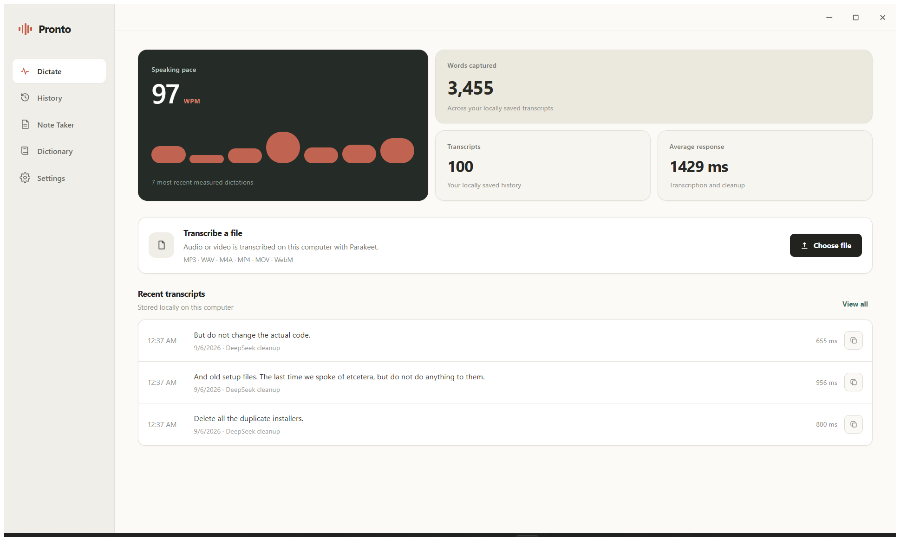

# Pronto

Pronto is a Windows push-to-talk dictation application. Hold a global shortcut, speak, and your words appear in whatever application you were typing in — with local punctuation, cleanup, and history. It processes audio locally using an NVIDIA GPU and inserts text into the active application.



## For customers

### Dictate anywhere

* **Push-to-talk, globally.** A configurable shortcut (including modifier-only chords such as Win + Ctrl) starts and stops dictation from any application. Hold-to-talk or press-to-toggle, your choice.
* **Compact recording pill.** A small always-on-top overlay shows cancel, a live waveform, and finish controls without stealing focus from your work.
* **Paste last transcript.** A second global shortcut (default Win + Shift + V) pastes your most recent transcript wherever you are typing.
* **Automatic insertion.** Results are typed into the window you dictated from, with clipboard fallback when the target cannot accept input.

### Transcription that stays on your computer

* **Local speech engine.** Uses NVIDIA Parakeet TDT 0.6B v3 via CUDA. The model stays loaded in memory, so short phrases transcribe in well under a second with punctuation and capitalization included.
* **Fully offline after setup.** The microphone, transcription, and cleanup all run locally. The network is needed only during installation (one-time model download) and optionally for DeepSeek rewriting.
* **Private by design.** Audio never leaves the machine — it travels only to a local loopback transcription server. The DeepSeek API receives transcript text only when cloud cleanup is enabled, and the API key is stored in Windows Credential Manager.

### Cleanup and rewriting

* **Local cleanup.** Removes fillers and false starts and repairs punctuation automatically — no account or key required.
* **Optional DeepSeek rewrite.** Configure an API key to rewrite transcripts with DeepSeek V4 Flash, using an editable system prompt you control.
* **Personal dictionary.** Add names and specialist terms that Pronto must preserve; corrections apply deterministically after recognition.

### Meeting Note Taker

* **Record meetings locally.** Captures microphone plus Windows system audio directly to disk — no calendar connection or meeting bot required. Local window-title detection offers the recorder when a call is detected.
* **Background notes.** After recording stops, Pronto transcribes the meeting in chunks and generates structured notes (via DeepSeek when configured, with a local fallback otherwise).
* **Recording library.** Organizes recorded meetings and imported audio into folders with background processing status, word counts, durations, and focused transcript views with audio playback.
* **Audio and video import.** Transcribes the audio track from common media files (MP3, WAV, M4A, MP4, MOV, WebM) locally, from the Dictate screen or any Note Taker folder.

### Windows integration

* **System tray operation.** Lives in the tray with dictation status, meeting controls, and Paste Last Transcript. Closing the main window keeps background dictation active.
* **Starts at boot.** Optional silent launch into the tray.
* **Dictation sounds and audio ducking.** Short start/stop cues, plus optional ducking that lowers playback while dictating and restores its exact prior state.
* **GPU pressure relief.** Optionally frees the model's VRAM under sustained pressure; the next dictation briefly warms it back up.
* **Dashboard.** Speaking pace (WPM with recent-history chart), words captured, transcript count, and average response time across your locally saved history.

## Performance

On an NVIDIA RTX 4050 Laptop GPU, local transcription of an 11-second audio file takes 86 ms. The microphone device is pre-opened at startup and the model stays resident, so hotkey activation has no device or model-loading delay.

## Requirements

* Windows 10 or 11 (64-bit)
* NVIDIA GPU with current display driver
* Microphone
* Internet connection (during installation for the one-time model download, and only for DeepSeek rewriting afterwards)

## Install

1. Download `Pronto_<version>_x64-setup.exe` from the [releases page](https://github.com/Jashith127/pronto/releases).
2. Run the installer (per-user, no admin needed). Setup downloads the speech model once with progress and verification.
3. Open **Settings** in Pronto.
4. Optional: Enter a DeepSeek API key. Local transcription works without a key.

## For developers

### Repository layout

* `ui/` — static frontend (HTML/CSS/JS) embedded by Tauri. No Node.js or npm involved.
* `src-tauri/` — Rust/Tauri backend: global hotkeys, audio capture, transcription pipeline, overlay windows, tray, installer hooks.
* `src-tauri/installer-hooks.nsh` — NSIS logic that downloads and verifies the speech model at install time.
* `ARCHITECTURE.md` — pipeline, latency design, storage, and Windows lifecycle details.
* `RELEASE_NOTES.md` — per-version changelog.

### How it fits together

A global shortcut wakes a Rust coordinator that captures prewarmed microphone audio, sends it to a persistent local Parakeet server, runs deterministic cleanup (plus optional DeepSeek rewrite), and inserts Unicode text into the previously focused window via SendInput. The frontend receives only status and result events over Tauri IPC — audio never crosses into JavaScript. See `ARCHITECTURE.md` for the full pipeline.

### Build

The installer is slim (~100 MB): the ~681 MB speech model is excluded from bundle resources and fetched with hash verification during setup. Run these commands in PowerShell to test and build:

```powershell
cd src-tauri
cmd.exe /d /s /c '"C:\Program Files (x86)\Microsoft Visual Studio\18\BuildTools\Common7\Tools\VsDevCmd.bat" -arch=x64 && cargo test --offline'
cargo tauri build

```

The installer lands at `src-tauri/target/release/bundle/nsis`.

*Note: Frontend files are static and embedded by Tauri. Do not run Node.js or npm.*

### Windows Behavior

* Pronto runs without a console window.
* Closing the main window keeps background dictation active in the system tray.
* The application keeps the microphone active to avoid device initialization delay.
* Third-party software licenses are available in `THIRD_PARTY_NOTICES.md`.
