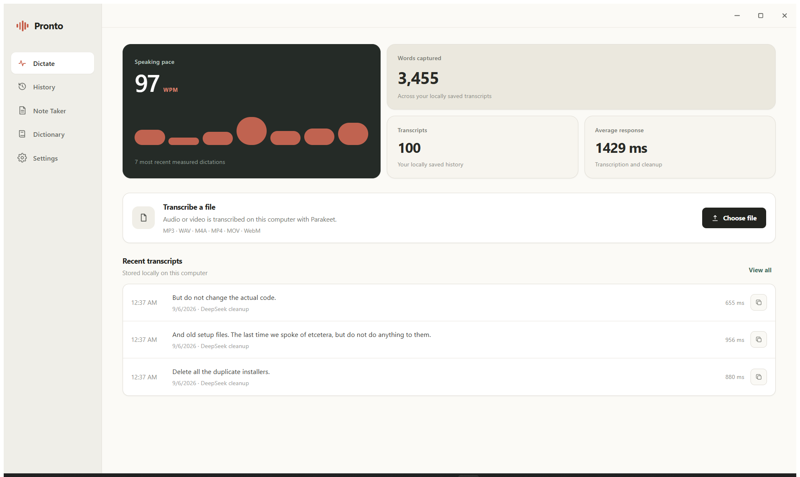

# Pronto

**Speak. Pronto types.** Pronto is a push-to-talk dictation app for Windows. Push a shortcut, speak, and release. Pronto writes your words into the app that you use. The speech engine runs on your computer, so your audio stays on your computer.



Pronto 1.0 is the first stable release.

## What Pronto does

| Feature | What it does |
|---|---|
| **Dictation** | Push the shortcut in any app and speak. Pronto types the text into that app. |
| **Paste Last** | Push a second shortcut to paste your last transcript again. |
| **Voice search** | Ask a question aloud. Pronto finds web results and shows a short answer with sources. |
| **Note Taker** | Records meetings from your microphone and your computer audio. Pronto then makes a transcript and meeting notes. |
| **File transcription** | Transcribes audio and video files: MP3, WAV, M4A, MP4, MOV and WebM. |
| **Dictionary** | Keeps names and special terms correct in every transcript. |
| **AI cleanup** | Optional. An AI provider removes filler words and corrects the text. |

## Dictation

1. Put the cursor in a text field in any app.
2. Push and hold **Ctrl + Alt + Space**.
3. Speak.
4. Release the keys. Pronto types the text.

You can change the shortcut in **Settings → Shortcuts**. You can also select toggle mode: push one time to start, and push again to stop. Modifier-only shortcuts, for example **Win + Ctrl**, are also possible.

A small pill shows on the screen while Pronto listens. The pill has a live waveform, a cancel button and a finish button. The pill does not take the focus from your app.

Pronto transcribes long dictations while you speak. When you stop, Pronto has only the last part of the audio to do. Thus a 60-second dictation is usually ready in less than half a second on Parakeet.

To paste the last transcript again, push **Win + Shift + V**.

## Voice search

1. Push **Win + Space**.
2. Speak your question.
3. Read the answer in the panel.

Pronto gets results from DuckDuckGo. Your AI provider then writes a short answer from these results, with citations. The panel shows the answer first. The sources are below the answer.

* Click a link to open it in your browser. The panel then closes.
* Click an "Ask next" suggestion to do a follow-up search.
* Click outside the panel to put it in a small tab at the bottom-left of the screen. Click the tab to open the answer again. The tab closes after two minutes.

**Note:** Windows also uses **Win + Space** to change the keyboard layout. Your layout can change when you use this shortcut. If this is a problem, change the shortcut in **Settings → Shortcuts**.

## Note Taker

* **Record a meeting.** Pronto records your microphone and your Windows audio to the disk. You do not need a calendar connection or a meeting bot.
* **Meeting detection.** When a meeting app uses your microphone for approximately 10 seconds, Pronto asks if you want to record. Pronto knows Zoom, Teams, Google Meet, Slack, Discord and other apps.
* **Fast stop.** When you stop a recording, Pronto is ready again in approximately one second. This is also true for a two-hour meeting. Pronto makes the transcript and the notes in the background and shows the progress.
* **Meeting notes.** Your AI provider writes structured notes. If you do not have an AI provider, Pronto makes local notes.
* **Library.** Put recordings and imported files in folders. Search all notes, and move recordings with drag-and-drop. Each recording has tabs for notes and transcript, and an audio player.

## Speech engines

Pronto has two local speech engines. Pronto Setup examines your PC and recommends one.

| | **Parakeet** | **Phonon** |
|---|---|---|
| Model | NVIDIA Parakeet TDT 0.6B v3 | Fermion Phonon-2 |
| Hardware | NVIDIA GPU | Any 64-bit CPU with AVX2 |
| Languages | 25 | English only |
| Speed | Fastest | Slower, but good for daily dictation |
| Download | Approximately 780 MB | Approximately 350 MB |

To change the engine, go to **Settings → Speech engine**. Pronto downloads the other engine and changes to it when the download is complete. You do not have to install Pronto again.

## Privacy

* Your audio does not go out of your computer. Pronto sends it only to the local speech engine.
* After setup, dictation, transcription and local cleanup work offline.
* Pronto sends text to your AI provider only when you turn on AI cleanup, meeting notes or voice search answers.
* Voice search sends your question text to DuckDuckGo.
* Pronto keeps your API keys in Windows Credential Manager.
* Pronto keeps settings and the last 100 transcripts in `%LOCALAPPDATA%\Pronto`.

## AI cleanup

Local cleanup is always available. It removes filler words and false starts, and it corrects punctuation. It does not need an account or a key.

For better text, add an AI provider in **Settings → Online services**:

* **DeepSeek** (recommended)
* OpenAI
* Anthropic
* Google Gemini
* Groq
* OpenRouter
* A custom endpoint that is compatible with OpenAI, for example Ollama or LM Studio

Enter the API key, then select a model from the list. The same provider writes your meeting notes and your voice search answers.

## Other features

* **Welcome tour.** On the first start, a short tour helps you set the shortcut and the microphone, and lets you try dictation. You can skip it. To see it again, go to **Settings → General → Show tour**.
* **Light and dark mode.** Select System, Light or Dark in **Settings → General**. The listening pills always stay dark, so you can see them on all apps.
* **Settings search.** Push **Ctrl + F** in Settings to find a setting.
* **System tray.** Pronto stays in the tray when you close the main window. Dictation continues to work.
* **Start with Windows.** Optional. Pronto starts silently in the tray.
* **Sounds and audio ducking.** Pronto plays a short sound when dictation starts and stops. It can also make other audio quieter while you dictate.
* **GPU memory release.** Optional. When a game needs GPU memory, Pronto releases Parakeet. The next dictation loads it again.
* **Dashboard.** Shows your speaking speed (words per minute), word count, transcript count and average response time.

## Requirements

* Windows 10 or 11, 64-bit
* A microphone
* **For Parakeet:** an NVIDIA GPU with a current driver
* **For Phonon:** an Intel or AMD CPU with AVX2 (most PCs from 2015 and later)
* An internet connection during setup, for the one-time engine download
* Optional: an API key from an AI provider

## Install

1. Download `Pronto_Setup_<version>_x64.exe` from the [Releases page](https://github.com/Jashith127/pronto/releases).
2. Run Pronto Setup. You do not need administrator rights.
3. Accept the recommended speech engine, or select the other one.
4. Wait for the download to complete. Setup shows the size, speed and time remaining.
5. Start Pronto and follow the welcome tour.

If Pronto is already installed, Setup gives two options:

* **Update** keeps your history and settings.
* **Reinstall** removes the app and the speech engines, then installs them again. To also erase your history and settings, select **Also erase my history and settings**.

Downloads continue after a cancel or a connection failure. Setup checks each file with a SHA-256 checksum.

To uninstall, go to **Windows Settings → Apps → Installed apps → Pronto**. You can keep or remove your history and settings.

## Pronto for Mac (preview)

Pronto for Mac is a port for Apple Silicon Macs with macOS 13 or later. It is not a stable release. The [`v0.8.2-macos` release](https://github.com/Jashith127/pronto/releases/tag/v0.8.2-macos) has a preview DMG. This DMG has an ad hoc signature and is not notarized by Apple, so macOS can block it. Allow it in System Settings.

On Mac, the default shortcuts are:

* Dictation: **Control + Option + Space**
* Paste Last: **Control + Option + V**
* Voice search: **Control + Option + S**

For permissions, status and known problems, see [the macOS port status](docs/macos-port-status.md).

---

## For developers

### How it works

A global shortcut starts a Rust coordinator. The coordinator records audio from a microphone stream that is already open, and sends the audio to a local speech server that stays loaded. It then cleans the text (local rules, plus an optional AI rewrite) and types it into the window that had focus, with `SendInput`. The frontend gets only status and result events through Tauri IPC. Audio never goes into JavaScript.

For the full pipeline, latency design and platform details, see [`ARCHITECTURE.md`](ARCHITECTURE.md).

### Repository layout

| Path | Contents |
|---|---|
| `ui/` | Static frontend (HTML, CSS, JS) for the app, overlays and Pronto Setup. No Node.js or npm. |
| `src-tauri/` | Rust/Tauri backend: hotkeys, audio, speech engines, cleanup, search, meetings, tray. |
| `src-tauri/src/platform/macos/` | macOS-only code: hotkeys, Accessibility insertion, CoreAudio, ScreenCaptureKit, permissions. |
| `installer/` | Pronto Setup, the custom Windows installer (a small Tauri app). |
| `crates/speech-packs/` | Shared pack manifest, resumable SHA-256-verified downloads, zip unpacking, GPU detection. |
| `scripts/` | Build scripts for speech packs, the installer and macOS, plus the macOS release upload. |
| `scripts/benchmarks/` | Speech engine benchmarks and findings. |
| `docs/` | macOS port plan, status and validation, plus QA notes. |
| `ARCHITECTURE.md` | Pipeline, latency, storage and lifecycle details. |
| `RELEASE_NOTES.md` | Changes in each version. |

### Build on Windows

Build the speech packs one time for each runtime or model change. Then build the installer. The manual *Windows release artifacts* workflow in CI also does these steps.

```powershell
# 1. Speech packs: CUDA runtime, Phonon CPU runtime, Phonon-2 model
#    (needs Git LFS and Python 3.12)
scripts/build-speech-packs.ps1
#    Upload dist/speech-packs/*.zip to the `speech-packs-v1` release.
#    Copy the printed size and sha256 values into
#    crates/speech-packs/speech-packs.manifest.

# 2. Installer: dist/Pronto_Setup_<version>_x64.exe
#    (needs Node.js for the Tauri CLI)
scripts/build-installer.ps1
```

Run the tests from a Visual Studio developer shell:

```powershell
cd src-tauri
cmd.exe /d /s /c '"C:\Program Files (x86)\Microsoft Visual Studio\2022\BuildTools\Common7\Tools\VsDevCmd.bat" -arch=x64 && cargo test --offline'
```

Silent install and uninstall:

```text
Pronto_Setup_<version>_x64.exe /S --model=auto|parakeet|phonon [--reinstall|--fresh]
uninstall.exe --uninstall --silent [--remove-data]
```

`--reinstall` removes the app and engines but keeps history and settings. `--fresh` removes all.

The legacy NSIS installer (`cargo tauri build`, output in `src-tauri/target/release/bundle/nsis`) is kept as a fallback. It downloads the model during setup with `src-tauri/installer-hooks.nsh`.

### Build on macOS

You need macOS 13 or later on Apple Silicon, Xcode Command Line Tools and Rust.

```sh
scripts/prepare-macos-assets.sh
cd src-tauri
cargo fmt --check
cargo test --target aarch64-apple-darwin
cargo check --target aarch64-apple-darwin
cd ..
scripts/build-macos.sh local
```

The `.app` and `.dmg` are in `src-tauri/target/aarch64-apple-darwin/release/bundle/`. The model is not in the app. Pronto downloads it on the first start to `~/Library/Application Support/app.pronto.dictation/models/`.

For a signed and notarized build, install a Developer ID Application certificate. Set `APPLE_SIGNING_IDENTITY`, and also set the App Store Connect API key variables (`APPLE_API_ISSUER`, `APPLE_API_KEY`, `APPLE_API_KEY_PATH`) or the Apple ID variables (`APPLE_ID`, `APPLE_PASSWORD`, `APPLE_TEAM_ID`). Then run `scripts/build-macos.sh signed`. Do not put credentials in the repository.

To upload a new Mac DMG from Windows, put the DMG and its `.sha256` in `release-assets/`, then run:

```powershell
.\scripts\publish-macos-release.ps1 -Repo Jashith127/pronto -Tag v0.8.2-macos
```

Git ignores the DMG. Commit only the `.sha256`. See [Upload the macOS DMG from Windows](docs/upload-macos-release-from-windows.md).

### CI

`.github/workflows/desktop-ci.yml` runs check, clippy and tests on `macos-15` (Apple Silicon) and `windows-2022` (x64). `.github/workflows/windows-release.yml` builds the Windows release artifacts.

### License notices

Third-party licenses are in [`THIRD_PARTY_NOTICES.md`](THIRD_PARTY_NOTICES.md).
