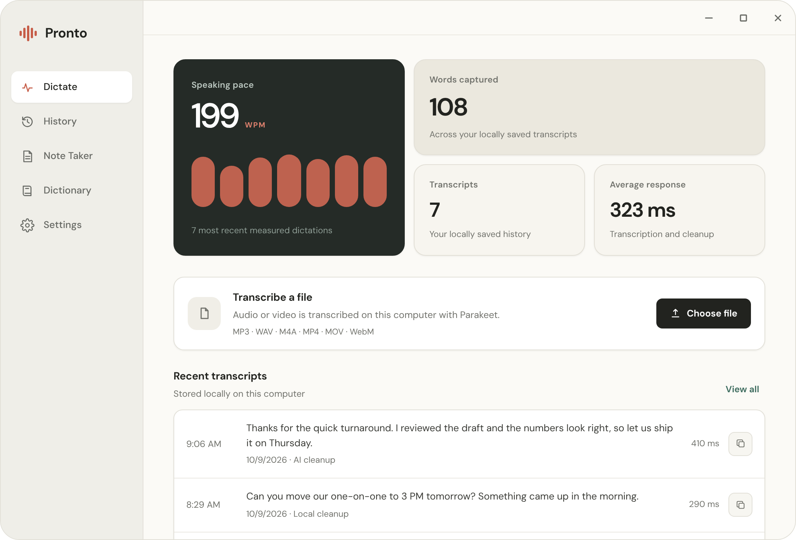
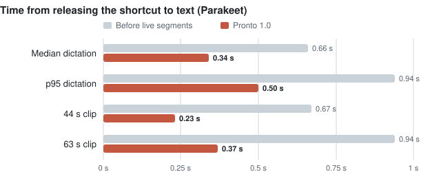
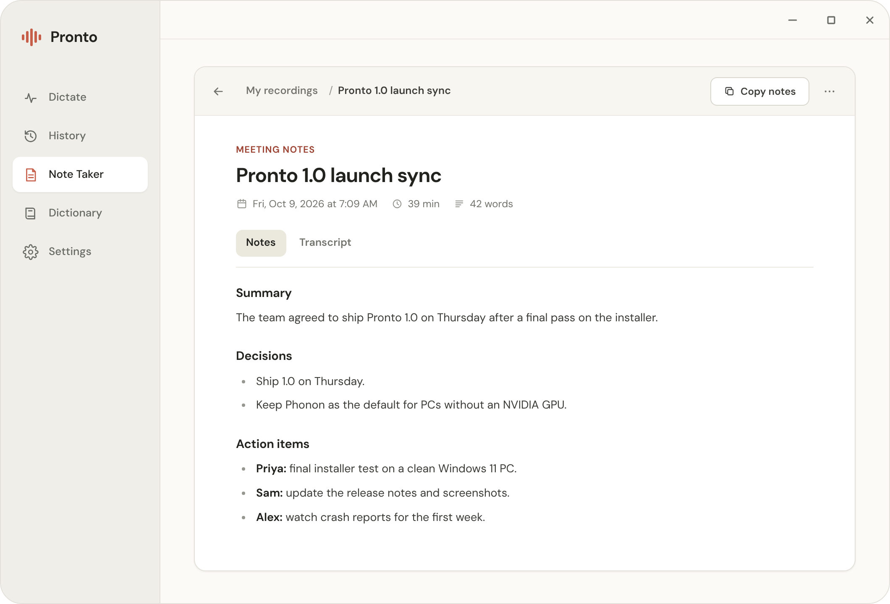
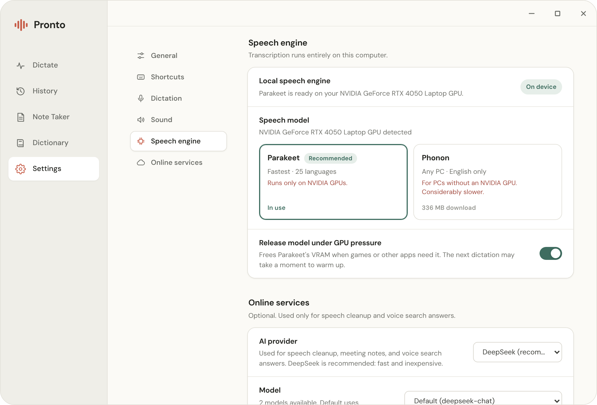
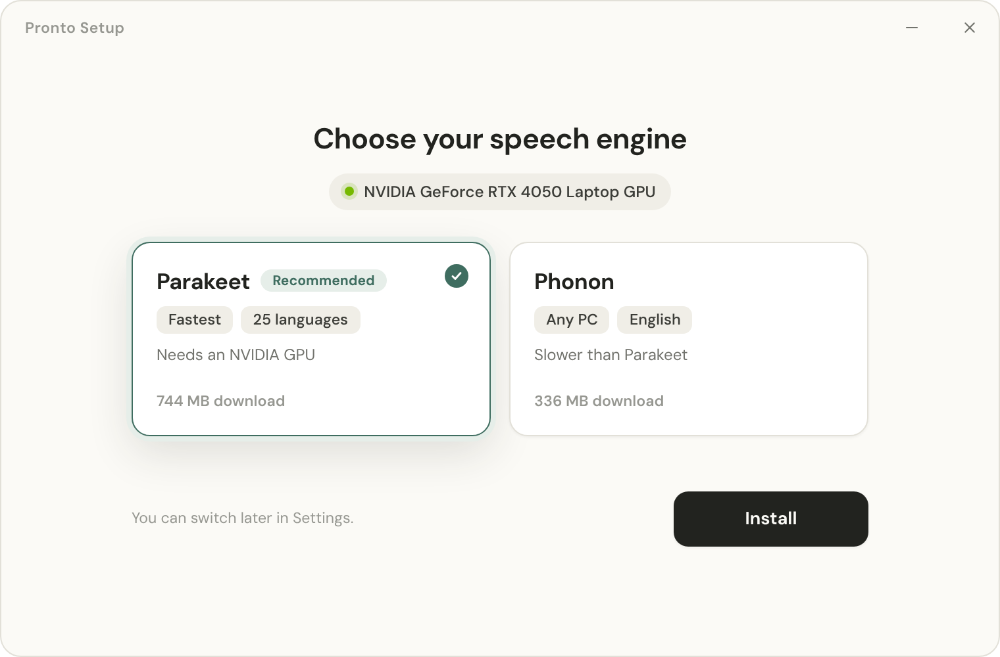
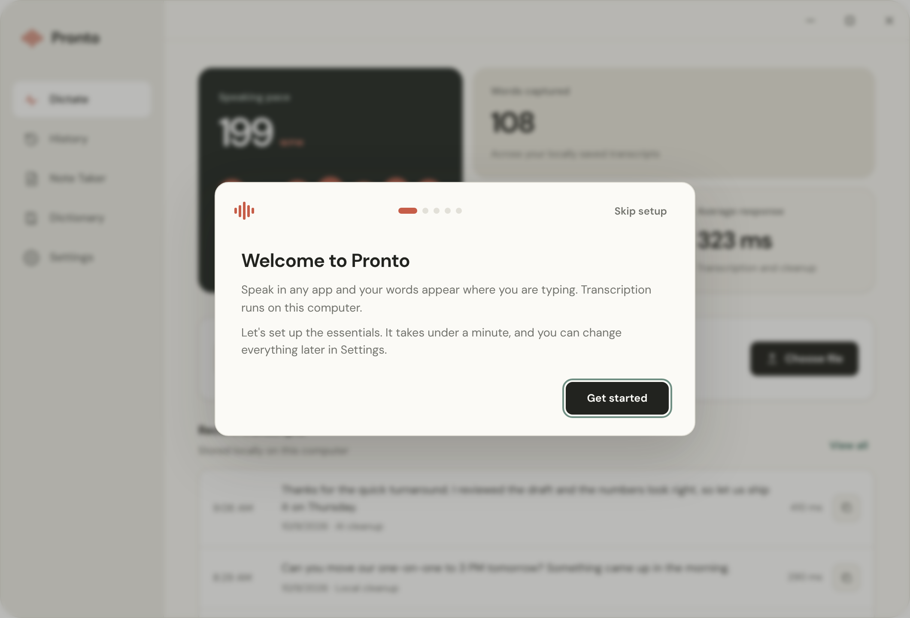
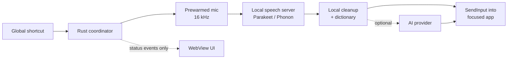

# Pronto

**Hold a shortcut, speak, let go. Your words appear wherever you're typing.**

Pronto is push-to-talk dictation for Windows, with voice search and a meeting note taker built in. Speech recognition runs locally, so your audio never leaves your PC.

<picture>
  <source media="(prefers-color-scheme: dark)" srcset="docs/images/dictate-dark.png">
  
</picture>

## Features

| | |
|---|---|
| **Dictation** | **Ctrl + Alt + Space** in any app. Hold-to-talk or toggle, fully remappable (modifier-only chords like Win + Ctrl work too). |
| **Paste Last** | **Win + Shift + V** pastes your latest transcript again. |
| **Voice search** | **Win + Space**, ask a question, get a short cited answer from DuckDuckGo results. |
| **Note Taker** | Records mic + system audio, then writes a transcript and structured meeting notes. No bot, no calendar link. |
| **File transcription** | MP3, WAV, M4A, MP4, MOV and WebM, transcribed locally. |
| **Dictionary** | Names and jargon that Pronto must always spell your way. |
| **AI cleanup** | Optional. Local cleanup is always on; an AI provider can polish further. |

Also: light and dark mode, a first-run tour (replay it from **Settings → General**), Ctrl + F settings search, tray mode, launch at startup, start/stop sounds, audio ducking, and a speaking-pace dashboard.

### Fast

Pronto transcribes long dictations *while you're still talking*, so releasing the shortcut only leaves the last few seconds to process.



### Voice search

The answer comes first, sources sit behind a disclosure, and "Ask next" chips run follow-up searches. Click away and the answer parks as a small tab for two minutes.


> Windows also uses Win + Space to switch keyboard layouts. Remap it in **Settings → Shortcuts** if that gets in the way.

### Note Taker

Pronto offers to record when a meeting app (Zoom, Teams, Google Meet, Slack, Discord…) has been using your mic for about 10 seconds. Stopping takes about a second even after a two-hour call; transcription and notes finish in the background. Recordings live in searchable folders with drag-and-drop.



## Speech engines

Pronto Setup checks your hardware and recommends one. Switch any time in **Settings → Speech engine**, no reinstall needed.

| | **Parakeet** | **Phonon** |
|---|---|---|
| Model | NVIDIA Parakeet TDT 0.6B v3 | Fermion Phonon-2 |
| Runs on | NVIDIA GPU | Any 64-bit CPU with AVX2 |
| Languages | 25 | English |
| Speed | Fastest | Slower, fine for everyday dictation |
| Download | ~780 MB | ~350 MB |



## AI providers

Pick one in **Settings → Online services**: **DeepSeek** (recommended), OpenAI, Anthropic, Google Gemini, Groq, OpenRouter, or any OpenAI-compatible endpoint such as Ollama or LM Studio. Choose a model from the provider's live list. The same provider handles dictation cleanup, meeting notes and search answers.

## Privacy

* Audio only ever goes to the local speech engine. Dictation and transcription work offline after setup.
* Your AI provider sees transcript text only when you turn on AI cleanup, meeting notes or search answers. Voice search sends the question text to DuckDuckGo.
* API keys live in Windows Credential Manager. Settings and the last 100 transcripts live in `%LOCALAPPDATA%\Pronto`.

## Install

**Requirements:** Windows 10 or 11 (64-bit), a microphone, and an NVIDIA GPU for Parakeet *or* any AVX2 CPU (most PCs since 2015) for Phonon. You need internet once, for the engine download.

1. Download `Pronto_Setup_<version>_x64.exe` from [Releases](https://github.com/Jashith127/pronto/releases). No admin rights needed.
2. Pick an engine and install. Downloads resume after a cancel or dropped connection, and every file is SHA-256 verified.
3. Launch Pronto and follow the short tour (or skip it).

<p>
  
  
</p>

Running Setup again offers **Update** (keeps everything) or **Reinstall** (optionally erasing history and settings). Uninstall from **Windows Settings → Apps**.

## Pronto for Mac (preview)

An Apple Silicon port (macOS 13+) lives in this repo but isn't a stable release yet. The [`v0.8.2-macos` release](https://github.com/Jashith127/pronto/releases/tag/v0.8.2-macos) has a preview DMG (ad hoc signed, not notarized). Shortcuts: Control + Option + Space (dictate), Control + Option + V (paste last), Control + Option + S (search). See [the macOS port status](docs/macos-port-status.md).

---

## For developers

### How it works


```mermaid
flowchart LR
    A[Global shortcut] --> B[Rust coordinator]
    B --> C[Prewarmed mic<br/>16 kHz]
    C --> D[Local speech server<br/>Parakeet / Phonon]
    D --> E[Local cleanup<br/>+ dictionary]
    E -. optional .-> F[AI provider]
    E --> G[SendInput into<br/>focused app]
    F --> G
    B -. status events only .-> H[WebView UI]
```

Audio stays in Rust and never reaches JavaScript. See [`ARCHITECTURE.md`](ARCHITECTURE.md) for the full pipeline and latency design.

### Repository layout

| Path | Contents |
|---|---|
| `ui/` | Static frontend (HTML, CSS, JS) for the app, overlays and Pronto Setup. No Node.js or npm. |
| `src-tauri/` | Rust/Tauri backend: hotkeys, audio, speech engines, cleanup, search, meetings, tray. |
| `src-tauri/src/platform/macos/` | macOS-only code: hotkeys, Accessibility insertion, CoreAudio, ScreenCaptureKit, permissions. |
| `installer/` | Pronto Setup, the custom Windows installer (a small Tauri app). |
| `crates/speech-packs/` | Shared pack manifest, resumable SHA-256-verified downloads, zip unpacking, GPU detection. |
| `scripts/` | Build scripts for speech packs, the installer and macOS, plus the macOS release upload. |
| `scripts/benchmarks/` | Speech engine benchmarks and findings. |
| `docs/` | macOS port docs, QA notes and README images. |

### Build on Windows

Build speech packs once per runtime/model change, then the installer (CI's manual *Windows release artifacts* workflow does both).

```powershell
# 1. Speech packs: CUDA runtime, Phonon CPU runtime, Phonon-2 model
#    (needs Git LFS and Python 3.12)
scripts/build-speech-packs.ps1
#    Upload dist/speech-packs/*.zip to the `speech-packs-v1` release.
#    Copy the printed size and sha256 values into
#    crates/speech-packs/speech-packs.manifest.

# 2. Installer: dist/Pronto_Setup_<version>_x64.exe
#    (needs Node.js for the Tauri CLI)
scripts/build-installer.ps1
```

Tests (from a VS developer shell):

```powershell
cd src-tauri
cmd.exe /d /s /c '"C:\Program Files (x86)\Microsoft Visual Studio\2022\BuildTools\Common7\Tools\VsDevCmd.bat" -arch=x64 && cargo test --offline'
```

Silent install/uninstall (`--reinstall` keeps history and settings, `--fresh` removes everything):

```text
Pronto_Setup_<version>_x64.exe /S --model=auto|parakeet|phonon [--reinstall|--fresh]
uninstall.exe --uninstall --silent [--remove-data]
```

The legacy NSIS installer (`cargo tauri build`) is kept as a fallback.

### Build on macOS

Apple Silicon, macOS 13+, Xcode Command Line Tools and Rust:

```sh
scripts/prepare-macos-assets.sh
cd src-tauri
cargo fmt --check
cargo test --target aarch64-apple-darwin
cargo check --target aarch64-apple-darwin
cd ..
scripts/build-macos.sh local
```

Output lands in `src-tauri/target/aarch64-apple-darwin/release/bundle/`; the model downloads on first launch. For signed/notarized builds, set `APPLE_SIGNING_IDENTITY` plus App Store Connect or Apple ID credentials in the environment and run `scripts/build-macos.sh signed`. To publish a DMG from Windows, see [Upload the macOS DMG from Windows](docs/upload-macos-release-from-windows.md).

### CI and licenses

`desktop-ci.yml` runs check, clippy and tests on `macos-15` and `windows-2022`; `windows-release.yml` builds release artifacts. Third-party licenses are in [`THIRD_PARTY_NOTICES.md`](THIRD_PARTY_NOTICES.md). Changes per version are in [`RELEASE_NOTES.md`](RELEASE_NOTES.md).
